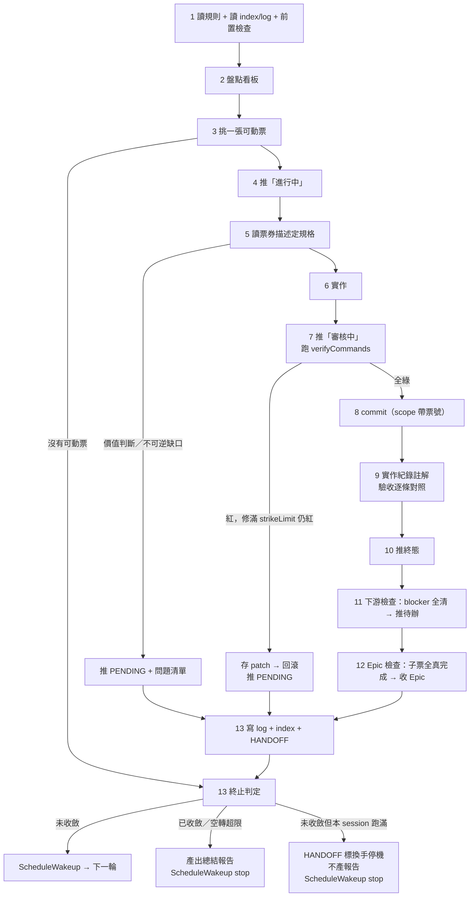

# Jira Goal Loop

無人監督下把 Jira 看板推進到收斂的規則檔。**每一輪開頭完整讀一次本檔**——跨輪的 context 會被摘要壓縮，你不能假設自己記得上一輪的任何事。

本檔是**規則**，不是進度。規則不隨輪次改變；要改規則得使用者在場。

---

## 0. 檔案分工

| 檔案 | 職責 | 生命週期 |
| --- | --- | --- |
| 本 skill（`SKILL.md`） | 通用規則：怎麼挑票、怎麼判定、什麼不准做 | 不變。要改得使用者在場 |
| `<project>/.claude/jira-workflow.json` → `goalLoop` | 專案設定：驗證指令、終態集合、路徑、上限值 | 幾乎不變。實查與設定不符時照第 10 步處理 |
| `goalLoop.landminesPath` | 專案地雷表：踩過的坑與對策 | loop 可 **append** 新地雷，不改既有列 |
| `goalLoop.step0Path` | 本次開跑的一次性任務與預期落點 | Step 0 完成後只讀不寫 |
| `goalLoop.logPath` | 歷史。每輪 append 一段，含**失敗過的做法** | **append-only，永不刪改既有段落** |
| `goalLoop.indexPath` | 索引。三振票／PENDING 票／失敗做法各一行 | 每輪覆寫 |
| `goalLoop.handoffPath` | 快照。使用者這一刻推門進來，一頁看懂現在在哪 | 每輪覆寫 |

log 絕對不能覆寫——它唯一的價值就是「第 8 輪的你不要重犯第 3 輪的錯」。index 與 HANDOFF 被覆寫沒關係，完整歷史在 log 裡。

**index 存在的理由**：log 跑到二三十輪會長到每輪重讀都吃掉可觀 context，而你真正每輪需要的只有「哪些票別再碰」與「哪些做法別再試」。所以每輪覆寫一份壓縮索引，讀取策略見第 1 步。

### 設定檔缺 `goalLoop` 區塊時

不要猜、不要沿用別的專案的值。用 `AskUserQuestion` 問齊下列項目後寫進 `jira-workflow.json`，再開始 Step 0：

```jsonc
"goalLoop": {
  "branch": "<所有 commit 疊在這個分支>",
  "verifyCommands": ["<每輪必跑，全綠才算過>"],
  "terminalStates": ["done", "pending", "apiRequire", "block"],
  "unverifiedLabel": "unverified",
  "strikeLimit": 3,              // 同票驗證失敗最多修幾次
  "maxRoundsPerTicket": 2,       // 同票最多佔用幾輪
  "roundBudgetMinutes": 45,      // 單輪軟上限，超了就收尾排下一輪
  "maxIdleRounds": 2,            // 連續幾輪零產出就停
  "maxRoundsPerSession": 6,      // 同一個對話 session 最多跑幾輪，滿了就停機請使用者 /clear 重開
  "logPath": ".claude/goal-loop-log.md",
  "indexPath": ".claude/goal-loop-index.md",
  "landminesPath": ".claude/goal-loop-landmines.md",
  "step0Path": ".claude/goal-loop-step0.md",
  "handoffPath": "HANDOFF.md",
  "reportDir": ".claude/report",
  "protectedPaths": ["CLAUDE.md", "CLAUDE.local.md", ".claude/skills/**", ".mcp.json", "**/settings.json"],
  "allowVersionBumps": true,
  "runOnDevice": false           // true 才可以自己開 appium/模擬器跑實機驗證
}
```

`terminalStates` 的每個值都必須能對應到 `transitions` 或 `extraStatuses` 裡的一筆；對不上就是設定寫錯，停下來問，不要自己找一個像的推。

---

## 1. 目標與終止條件

**目標**：把看板上所有非 Epic 票推進到終態集合。

**終態集合**由 `goalLoop.terminalStates` 定義。典型四者（任一即算收斂）：

| 狀態 | 意義 | 誰能讓它繼續前進 |
| --- | --- | --- |
| **完成** | 做完了，`verifyCommands` 全綠 | — |
| **PENDING** | **使用者的收件匣**：需要他本人動手或裁示 | 使用者 |
| **API Require** | 缺後端（必掛 `apiRequireLabel`） | 後端 |
| **Block** | 純粹被另一張未完成票擋住（等票，不等人） | 上游票 |

**終止判定**（每輪第 13 步跑）：

```
所有非 Epic 未完成票 ⊆ 終態集合  ∧  沒有可動票
  → 產出總結報告 → ScheduleWakeup(stop)
```

Epic 票（`issuetype.hierarchyLevel > 0`）**不算進終止判定**，它們是容器不是任務。

### 為什麼終態集合要這樣定

使用者常見的原始說法是「全部做完，剩下需要人工處理的也算」。照字面實作永遠不收斂：看板上通常有一批「等後端」的票，使用者不動它們也解不掉，你不動它們也解不掉。所以「缺後端」必須明確納入終態，否則 loop 會一路撞牆到天亮。

同理，一張票的未完成 blocker 若**全部**落在終態集合，它自己就繼承了那個阻塞（被一張永遠不會動的 API Require 票擋住）。這種票**算可動**，處理方式見第 5 步「部分實作」。

---

## 2. 詞彙表

這幾個詞在本 loop 有精確語意，與 Jira 預設或其他專案的用法不同。用錯會把票推到錯的欄，而使用者回來時會依賴這些欄位做決策。

**可動票**
非 Epic ∧ 不在終態集合 ∧（無 blocker ∨ 所有未完成 blocker 都落在終態集合）。
方向判準：`issuelinks[].inwardIssue` 存在 = 對方擋我；`outwardIssue` 存在 = 我擋對方。**不要用 `type.outward == "blocks"` 判斷**——`inward` 與 `outward` 兩個描述字串在每一筆連結上永遠都在，那樣判會讓整份可動清單反過來。

**完成**
你做完了，且 `goalLoop.verifyCommands` 全部綠燈。
不代表驗收條件全部實測過——那由下面這個 label 區分。

**`unverifiedLabel`**
掛在「完成」票上，表示**有驗收條件只能靠實機／IDE／真後端驗，而你沒驗**。
註解必須逐條標明哪幾條已自動驗過、哪幾條是推斷。使用者回來用 `labels = <unverifiedLabel>` 一條 JQL 就能撈出補驗清單。
**沒有這個 label 的完成票，等於你在宣告驗收條件全部實測通過。** 不確定就掛上去。

**PENDING**
**使用者的收件匣**：這張票需要他本人。五種情形：
1. 工作本身必須人手執行（開 IDE 改設定、跑實機情境、打真後端）
2. 規格缺口涉及使用者價值判斷或不可逆決策（第 5 步）
3. 高風險變更（如升版）必要但驗證沒全綠（第 11 節）
4. 三振出局（第 8 節）
5. 同一張票佔用超過 `maxRoundsPerTicket` 輪仍未推進（第 9 節）

註解**必須寫清楚要他做什麼**，具體到可執行。「需要驗證」不算；「跑 `<手順文件路徑>` 的 B-1 到 B-3，回報第 3 條的倒數秒數誤差」才算。

**Block**
純粹被另一張未完成票擋住。**只有這一種情形**。等票，不等人。要人的一律進 PENDING。

**API Require**
缺後端。判準一句話：**要解這個阻塞，得有人動後端嗎？** 是 → API Require + `apiRequireLabel`；否 → Block 或 PENDING。

---

## 3. Step 0（整個 loop 只跑一次）

`logPath` 若已有 Step 0 的完成紀錄就跳過整節，直接進第 4 節。

固定三項，每項做完在 log 勾掉：

1. **設定檔就位** — `jira-workflow.json` 存在且 `goalLoop` 齊全；`transitions` 的 id 至少對一張真票跑過 `getTransitionsForJiraIssue` 校正。
2. **工作區乾淨且編譯得過** — `git status` 沒有來歷不明的變更，`verifyCommands` 全綠。
   有殘留變更時：能歸屬到某張票就併進那張票的處理；歸屬不明就 `git stash push -u -m "<說明>"` 封存並在 log 記下，**不要試圖修它**——它不屬於任何票，修它會吃掉整輪。
   **這一步沒過不准進主循環。** 在編譯不過的基底上做票，之後每一輪驗證都會紅，而失敗原因跟正在做的票無關，你會一路盲目追一個不屬於你的錯，整晚報廢。
3. **記下起始 commit hash** — `git rev-parse --short HEAD` 寫進 log 表頭。使用者回來用 `git log <hash>..HEAD` 就能只看 loop 的產出。

外加 `goalLoop.step0Path` 裡列的專案一次性任務（例如把幾張狀態不實的票正名、把某個未完成重構結案）。那份檔案由使用者或開跑前的規格確認產生，逐條照做並在 log 勾掉。

---

## 4. 每輪流程

一輪 = 一張票。從挑票到推狀態全部跑完才排下一輪，不要中途切斷。



### 第 1 步：讀取與前置檢查

讀取順序與範圍：

1. 本檔（完整）
2. `jira-workflow.json`（完整）
3. `indexPath`（完整，很短）
4. `landminesPath`（完整）
5. `logPath` — **表頭 + 最後 3 輪**。index 已經摘了「別碰哪些票、別試哪些做法」，需要細節時才回頭讀特定輪次。index 若不存在（第一輪）就完整讀 log。

前置檢查，任一不過就先處理完再挑票：

- `git status` 乾淨（除了 log / index / HANDOFF 這三個 loop 自己的檔案）。有上輪殘留 → 依第 8 節回滾，並在 log 記下是哪一輪漏收的。
- 當前分支 == `goalLoop.branch`。不是就切回去，不要在別的分支上疊 commit。
- 若 index 標記上一輪異常中斷（見第 13 步的「收尾標記」），先把那一輪的收尾補完（推狀態、寫註解），再開新輪。

**判定本輪屬於哪個 session**（第 13 步的輪次上限要用）：

`/loop` 的每一輪都在**同一個對話 session** 裡被喚醒，context 只會一路疊上去。所以要能分辨「使用者 `/clear` 重開過」與「還是同一段對話的第 N 次喚醒」。

1. 從系統提示給的 scratchpad 目錄路徑取出 session id — 路徑形如 `…/<project>/<session-uuid>/scratchpad`，`scratchpad` 前一段就是。取前 8 碼即可。
2. 與 index 的 `**本 session**` 那一行比對：
   - **相同** → 同一個 session 續跑。`本 session 已跑` 加一。
   - **不同或該行不存在** → 新 session（使用者 `/clear` 過，或這是第一輪）。把 index 那一行改寫成新 id，`本 session 已跑` 歸 1。
3. **取不到 session id** → index 記 `session-id 不可得`，第 13 步改用退化判準（見該步）。

新 session 不影響任何其他計數：`已跑輪數`、`連續空轉`、三振紀錄都是跨 session 累計的，只有 `本 session 已跑` 會歸零。

### 第 2 步：盤點

跑 `check-jira-status`（唯讀，不會動票）。沒有這個 skill 時自己用 `searchJiraIssuesUsingJql` 盤，注意第 7 節的回傳爆量地雷。

它的「待修正」區可能有建議與本 loop 規則衝突（例如「審核中且有實作 commit → 確認驗收後推 done」）。那是給人看的建議，**推狀態一律以本檔第 10 步為準。**

### 第 3 步：挑票

排序判準：

1. **收尾優先** — `statusCategory == indeterminate`（進行中、審核中）排最前。半成品的價值是 0。
2. **解鎖效益** — 擋住的**未完成**下游數量，多者優先。已完成的下游不算，那種殘留連結會把效益虛報。
3. **Jira 優先序** — Highest → Lowest。
4. **票號小者優先** — 穩定收尾條件。

然後套四層過濾：

- 排除 Epic（`hierarchyLevel > 0`）
- 排除已在終態集合的票
- **排除 index 裡標記為已三振或已推 PENDING 的票**
- **排除本輪之前已連續佔用 `maxRoundsPerTicket` 輪的票**

後兩條最重要——沒有它們，loop 會每輪都挑同一張最急的難票，撞同一面牆到天亮。

### 第 4 步：推「進行中」

規格還沒釐清、還在調查也照推——調查本身就是這張票的工作。推法見第 10 步的三步流程。

### 第 5 步：定規格

票券描述是唯一規格來源。先完整讀完（含驗收條件、邊界情境、明確不驗的項目）再判斷缺什麼。

缺口依性質分流：

| 缺口性質 | 做法 |
| --- | --- |
| **只影響程式長相**（命名、檔案位置、要不要抽純函式、測試要幾個案例） | 照專案既有慣例自己決定，在實作紀錄註解寫下做了什麼選擇 |
| **影響使用者看到什麼，或不可逆**（要不要下架某功能、遷移資料、改 API 契約、動到別張票的範圍） | **不做**。推 PENDING，註解列出具體問題清單，換下一張票 |

問題清單要問得能回答。「規格不明」不算；「第 12 條：首頁統計卡目前全 0，要不要沿用單日統計同一套計算？沿用要多拉一次列表 API，不沿用則首頁會繼續顯示全 0」才算。

### 第 6 步：實作

遵守專案既有規則（`CLAUDE.md` / `CLAUDE.local.md`），不在本檔重複。函式庫／API 文件需求走 Context7 MCP，不要靠記憶。

**部分實作要標明。** 依第 1 節，blocker 落在終態的票算可動，做「不依賴 blocker」的那部分。這種票的註解必須明確寫出哪一塊是暫時實作、契約定案後可能要重寫，否則三個月後沒人分得出哪些是最終方案。

### 第 7 步：驗證

跑 `goalLoop.verifyCommands`，全綠才算過。失敗處理見第 8 節。

**除非 `goalLoop.runOnDevice` 為 true，不跑實機／不開瀏覽器自動化。** 需要實機驗證時產出操作手順文件到 `goalLoop.reportDir/${YYYY_MM_DD}/`，交給使用者跑。不要自己開 session 逐步點。

### 第 8 步：commit

commit message 沿用專案慣例，scope 帶票號：`feat(PROJ-24): 清掉兩個死入口`。

log / index / HANDOFF 的更新併進同一個 commit。該輪若三振沒有票 commit，就單獨 commit 一個 `chore(loop): 輪 N 紀錄`。

commit 前跑一次 `git status`，確認沒有意外檔案被夾帶（暫存檔、patch、產出物）。

### 第 9 步：實作紀錄註解

`addCommentToJiraIssue`，`contentFormat: "markdown"`，語言依 `conventions.commentLanguage`。**格式與寫作規則一律照 `.claude/jira-workflow.md` 的「註解怎麼寫」章節**——那份是唯一權威，本檔不重複也不覆寫。

那章講的重點，在 loop 情境下特別容易被省掉，這裡點名三個：

- **正文寫給人看，結構資料寫進末尾的 YAML 區。** 無人監督時最容易退化成一團「已完成相關處理」的抽象文字，那等於沒寫。
- **驗收逐條對照，四個固定詞（通過／部分通過／未實測／沒做）。** 只寫「已完成」等於沒寫。
- **`pitfalls` 要填。** 這一輪撞到的坑，原始錯誤訊息照抄。它與 `logPath` 的「失敗過的做法」是同一份素材的兩個出口——票上那份是給下一張票的人看的。

### 第 10 步：推終態

| 情形 | 推到 | 附帶動作 |
| --- | --- | --- |
| 驗收條件全部自動驗過 | `done` | — |
| 有驗收條件需實機／IDE／真後端 | `done` | 掛 `unverifiedLabel`；產出實機手順文件 |
| 需要使用者本人動手或裁示 | PENDING | 註解寫清楚要他做什麼 |
| 缺後端 | `apiRequire` | 掛 `apiRequireLabel` |
| 被另一張未完成票擋住 | `block` | 註解寫等哪張票 |

推任何狀態都照三步流程：讀 `jira-workflow.json` → `getTransitionsForJiraIssue` 查這張票**當下**可用的轉換 → `transitionJiraIssue`。不要拿設定檔的 id 直接送；票在不同狀態下可用的轉換不同。實查與設定檔不符時以實查為準，並在 log 記下設定檔該更新哪一欄。

**推送失敗的處理**（MCP 逾時、權限、轉換不可用）：

1. 重查 `getTransitionsForJiraIssue` 後重試一次。
2. 仍失敗 → **不要假裝成功、不要換一個看起來像的轉換推**。在 log 與 index 記下「PROJ-XX 程式已完成並 commit `<hash>`，但狀態推送失敗：`<錯誤原文>`，票仍停在 `<實際狀態>`」，HANDOFF 的 `Current State` 也要寫。
3. 註解若也推不上去，把註解內容原文落地到 `reportDir/${YYYY_MM_DD}/PROJ-XX-comment.md`，在 log 寫明路徑。

程式做完但狀態沒推上去，比程式沒做完更難察覺——看板顯示的是「沒人動過」。所以這件事一定要浮到 HANDOFF 上。

### 第 11 步：下游檢查

從剛推完那張票的 `issuelinks` 找出所有 `outwardIssue`（我擋對方）的下游票。對每一張下游票，查它**自己的**所有 `inwardIssue` 連結，逐一確認狀態。

- 所有 blocker 都完成 → 從 Block 推 `todo`，並加一則簡短註解說明是被哪張票（票號 + 標題）解開的
- 還有 blocker 未完成 → 不動，在 log 記下它還卡在哪張票

判斷依據一律是實查到的 blocker 狀態，不是推測。一張票只被一張票擋不代表就是剛完成的那張。

### 第 12 步：Epic 檢查

對每個 Epic 查它的子票。**所有子票都是真「完成」**（不含 PENDING / API Require / Block）→ 推 Epic 完成；否則不動。

有些 Epic（子票全需實機、子票多數缺後端）永遠不會被收，這是正確的，不要為了收 Epic 而放寬子票判準。

### 第 13 步：收尾與判定

順序固定，因為前一項失敗時後一項的內容會不實：

1. append 一段到 `logPath`（格式見 `references/log-format.md`）
2. 覆寫 `indexPath`（格式見 `references/log-format.md`）
3. 覆寫 `handoffPath`（格式見 `references/handoff-format.md`）
4. 跑第 1 節的終止判定，再套下面的「session 輪次上限」：
   - **已收斂** → 產出總結報告到 `reportDir/${YYYY_MM_DD}/`，然後 `ScheduleWakeup({stop: true})`
   - **未收斂，且本 session 未達輪次上限** → `ScheduleWakeup`，`prompt` 傳回同一份 `/loop` 輸入，`delaySeconds` 給 60，`reason` 寫「輪 N 完成（PROJ-XX → 完成），排下一輪」
   - **未收斂，但本 session 已達輪次上限** → 換手停機，見下

**session 輪次上限**：`本 session 已跑` 達到 `goalLoop.maxRoundsPerSession` 時，**即使還沒收斂也要停**：

1. **不**產出總結報告（那是收斂才做的，會讓使用者誤以為做完了）。
2. HANDOFF 頂端加一行醒目標記：

   ```markdown
   > ⚠️ **未收斂，換手停機**：本 session 已跑滿 N 輪。請 `/clear` 後重新下同一份 `/loop` 指令續跑——進度全在 log / index / 本檔，不會遺失。
   ```

3. index 的 `**本 session**` 那一行標上 `已達上限，待 /clear`。
4. log 本輪那段的 **結果** 後面補一句「本 session 輪次上限，換手停機」。
5. `ScheduleWakeup({stop: true})`。

**為什麼要有這條**：`/loop` 的喚醒（不論走 `ScheduleWakeup` 還是 `CronCreate`）都是**同一個 session 的再觸發**，沒有「每輪開新 session」的選項。context 一輪一輪疊上去，超過門檻就被自動摘要壓縮，而最先被壓掉的正是失敗細節與錯誤原文——也就是 log 最該記、下一輪最需要的東西。跑到十幾輪時，loop 表面還在動，實際已經在一份被壓爛的記憶上做決策。

停機是安全的，因為這份規則的狀態**全部外部化在 log / index / landmines / HANDOFF**，`/clear` 後的新 session 照第 1 步重讀就完全接得上。使用者付出的成本是打兩個指令，換到的是每個 session 都在乾淨的 context 上跑。

**退化判準**（第 1 步取不到 session id 時）：改用 `已跑輪數 % maxRoundsPerSession == 0` 觸發同樣的換手停機。代價是使用者若中途自己 `/clear` 過會多停一次，但 context 成長仍有上限——這個方向的誤判是安全的，反過來（永遠不停）不是。

**收尾標記**：進第 4 步之前，先在 index 頂端寫一行 `進行中：輪 N / PROJ-XX`；第 13 步做完就把它改成 `上輪已正常收尾：輪 N`。下一輪的第 1 步靠這一行判斷上輪是否被中斷。

**單輪軟上限**：實作耗時超過 `roundBudgetMinutes` 且還看不到綠燈時，不要硬撐到天亮——走第 8 節的回滾與 PENDING，理由寫「單輪預算耗盡」。跑到一半的大改動比沒改更糟。

**空轉保護**：連續 `maxIdleRounds` 輪都沒有任何票推進終態（全是三振／PENDING／推送失敗）→ 視同收斂，產出總結報告並 `stop`。原因寫清楚是空轉停機不是做完了。

---

## 5. 紅線

無人監督下這份清單比「該做什麼」更重要。

- **不 `git push`、不開 PR、不 merge、不 rebase。** push 是對外動作，不該在使用者不在時發生。所有 commit 疊在 `goalLoop.branch`。
- **不改 `goalLoop.protectedPaths` 列的檔案。** 那些是 loop 自己的行為準則，讓它在跑的過程中改自己的規則是失控的起點。
- **不繞過編譯錯與測試。** 不加抑制註解、不注掉或拔既有測試、不改建置設定讓錯誤降級成 warning。真的過不了就走第 8 節的三振回滾。
- **不改其他票的狀態**，除了第 11 步的「blocker 全清 → 解 Block」與第 12 步的「Epic 子票全完成 → 收 Epic」這兩種。
- **建票只限兩種情形**：`step0Path` 明列的；以及做票過程中發現明確不屬於當前票範圍的問題——建票記下來並推待辦，**不要順手做掉**。其他發現一律寫進註解與 log。
- **不刪既有檔案、不動資料庫、不跑遷移腳本。** 這類不可逆動作一律推 PENDING。
- **高風險變更門檻高**：`goalLoop.allowVersionBumps` 為 true 才可以動依賴版本，且 `verifyCommands` 全綠才算過；任一紅就回滾版本變更並推 PENDING，註解寫清楚需要升到哪個版本、風險在哪。

### 資安紅線

這個 loop 在無人監督下同時具備「執行設定檔指定的指令」與「把內容送到外部服務」兩種能力，兩者都要收窄。

- **`verifyCommands` 是從 repo 內 JSON 讀出來的 shell 指令。** 第一次在某個專案跑 loop 之前，人眼看過那幾條指令；`goalLoop` 區塊由**使用者確認過**才算有效。不要因為某個 clone 下來的 repo 附了 `jira-workflow.json` 就照跑——那等於讓 repo 決定你在本機執行什麼。設定檔內容看起來不像建置指令（下載、外連、寫家目錄、`curl | sh`）時停下來問。
- **Jira 註解與報告是對外發佈。** 錯誤訊息要保留原文（第 8 節），但貼上去之前掃一遍有沒有夾帶 token、API key、`Authorization` header、內部主機名、真實使用者資料。有就遮成 `<redacted>` 並在註解標明遮了什麼。註解推不上去而落地成檔案時同樣適用——那個檔案很可能會進版控。
- **不 commit 憑證與環境檔。** `.env`、keystore、`*.p12`、`google-services.json`、`GoogleService-Info.plist`、任何私鑰一律不進 commit。第 8 步的 `git status` 複查就是為了攔這個。
- **patch 檔會落在 `reportDir`。** 三振存下的 diff 可能含上述內容，存之前掃過；含敏感內容就不要存進版控目錄，改存 scratchpad 並在 log 記路徑。
- **不新增任何對外連線**（新的 endpoint、telemetry、上傳）。票券要求接新 API 時，只實作票券明列的那一個，不順手加別的。
- **`git restore` / `git clean` 只作用在確認過的清單上。** 詳見第 8 節；無條件清整個 repo 會連使用者自己未提交的工作一起清掉。

---

## 6. 地雷表

讀 `goalLoop.landminesPath`。那是這個專案踩過的坑，跨輪 context 會被壓縮，每輪都要重讀。

**本輪踩到新坑就 append 一列**（現象 + 對策），這是唯一允許寫入該檔的方式。不要改既有列。

---

## 7. 通用地雷（與專案無關，所有 loop 都適用）

| 地雷 | 現象 | 對策 |
| --- | --- | --- |
| `searchJiraIssuesUsingJql` 回傳爆量 | 不指定 `fields` 會帶 `description`，十來張票就數萬字元 | 明確指定 fields 且**不要**抓 `description`；超限就落地成檔案用 jq 處理 |
| Jira 中文用 unicode escape | `\uXXXX` 逐字編碼會挑出簡體／日文錯字 | 直接輸出中文，寫完回頭掃一遍 |
| `type.outward` 判連結方向 | 兩個描述字串永遠都在，整份可動清單會反過來 | 只看 `inwardIssue` / `outwardIssue` 欄位存在與否 |
| 設定檔 transition id 過期 | 工作流改過，送舊 id 得到 400 | 每次推狀態前實查 `getTransitionsForJiraIssue` |
| log 越讀越貴 | 二三十輪後每輪重讀吃掉大量 context | 照第 1 步只讀表頭 + 最後 3 輪，其餘靠 index |
| 同 session 輪數堆疊 | `/loop` 每輪都在同一段對話裡喚醒，context 反覆被壓縮，失敗細節先被壓掉 | 第 13 步的 session 輪次上限：跑滿就換手停機，使用者 `/clear` 後重下同一份 `/loop` |

---

## 8. 失敗處理：三振出局

同一張票的驗證失敗，**最多修 `goalLoop.strikeLimit` 次**。用滿仍紅：

1. **存下現場** — `git diff > <reportDir>/${YYYY_MM_DD}/PROJ-XX-failed.patch`（未追蹤檔另外 `git status --porcelain` 列進註解）
2. **工作區回到本輪起點** — `git restore .`，新增檔案逐一確認清單後才 `git clean`。**不要無條件 `git clean -fd` 整個 repo**
3. **推 PENDING**，註解必須寫：失敗現象（錯誤訊息原文）、嘗試過的各種修法各自為什麼沒用、patch 檔路徑
4. **log 與 index 標記這張票為已三振**，第 3 步的過濾會避開它
5. 換下一張票

**回滾不是放棄，是隔離。** patch 檔留著，使用者想接手時現場完整。但工作區必須乾淨——在編譯不過的基底上疊下一輪工作，是這套 loop 最容易自己挖給自己的坑。

修到後面通常不是修得更好，而是開始亂改（拔接口、加抑制、注掉測試）。那些是紅線。

---

## 9. 同票佔用上限

一張票即使沒有驗證失敗（例如一直在調查、一直在讀程式），也不能無限期佔用。連續佔用達 `goalLoop.maxRoundsPerTicket` 輪仍未推進終態：

- 已有可保留的產出 → commit（scope 帶票號，訊息標明「部分實作」），推 PENDING，註解寫清楚做到哪、下一步是什麼、卡在哪
- 沒有可保留的產出 → 照第 8 節回滾，推 PENDING

index 標記後，第 3 步的過濾會避開它。

---

## 10. 死鎖與異常收斂

第 3 步算出**可動票為 0，但仍有非終態票**時，不要沉默停機。逐張判定它為什麼不可動並推到正確的終態：

- 被未完成票擋住 → `block`（註解寫等哪張）
- 缺後端 → `apiRequire` + label
- 需要使用者 → PENDING

推完後重跑一次終止判定。若推完仍有票既非終態也判不出原因（例如連結資料本身矛盾），寫進總結報告的「無法歸類」一節並 `stop`——把判斷留給使用者，比自己選一個欄硬塞好。

---

## 11. 總結報告

收斂或空轉停機時產出到 `goalLoop.reportDir/${YYYY_MM_DD}/`，繁體中文，需要流程時用 Mermaid（`<br/>` 換行）。必含：

- **停機原因**：收斂 / 空轉超限 / 死鎖無法歸類，一句話講清楚
- 起始 commit → 結束 commit，以及 `git log` 一行式清單
- **票券去向表**：每張處理過的票 → 最終狀態 → 一句話理由
- **留給使用者的清單**，依急迫度排序：PENDING 票要他做什麼、`unverifiedLabel` 票要補驗什麼、patch 檔在哪、狀態推送失敗的票有哪些
- **不可信之處**：哪些「完成」是自動驗證過的、哪些是推斷的
