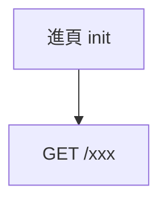

# Vault 結構與頁面樣板

**章節標題要照抄。** 別頁會用 `[[今日採購#商品卡]]` 這種 anchor 指過來，標題文字一改就全斷。

## 目錄

```
vault/
├─ 00-首頁.md
├─ 10-畫面/<畫面名>.md
├─ 20-API/<METHOD 用途>.md      例：POST 儲存採購明細.md
├─ 30-資料模型/<模型名>.md
├─ 40-機制/<機制名>.md
├─ 50-對照/欄位對照總表.md
└─ attachments/*.png
```

API 檔名用 **`METHOD` + 中文用途**（`POST 儲存採購明細`）而不是路徑。路徑裡的 `/` 不能當檔名，而且中文用途在 `[[` 自動補完時好找得多。真實路徑寫在頁面的 frontmatter 與標題。

## 畫面頁

````markdown
---
tags: [screen]
route: AppRoute.Xxx        # 不佔路由的寫「無（XXX 的畫面內狀態）」
---

# <畫面名>

> `screen/xxx/XxxScreen.kt` · `XxxScreenContent.kt` · `XxxViewModel.kt`
> 一兩句：這頁在做什麼、為什麼長這樣（設計理由值得寫，它解釋了不明顯的取捨）

---

## 畫面 ↔ 欄位

### <區塊名>

--- start-multi-column: <唯一ID>
```column-settings
Number of Columns: 2
Column Size: [34%, 66%]
border: off
```

![[03-採購中.png|280]]

--- column-break ---

| 看到的 | 欄位 | 來源 |
|---|---|---|
| `¥850` | `unit_price` | [[GET 待採購訂單]] |
| `剩 6` | `remaining` | [[GET 待採購訂單]] + [[GET 採購標記]] |
| 搜尋列 | 本機過濾 | — |

<這個區塊特有的注意事項>

--- end-multi-column

---

## 操作 → API



| 操作 | API |
|---|---|
| 進頁 / 重新整理 | [[GET 待採購訂單]] |

## UiState 重點

| 欄位 | 說明 |
|---|---|
| `canSubmit` | 送出鈕亮不亮的條件 |

## 相關
[[相關頁]] · [[欄位對照總表]]
````

「來源」欄**連 API 不連模型**。讀畫面頁的人在問「這個數字從哪條線上來的」，多繞一層模型頁是純粹的摩擦。反向問題由模型頁自己的區塊回答。

一個值算式跨兩支 API 時就兩支都列（`[[A]] + [[B]]`），不要簡化成一支——那是實際上會誤導人的簡化。

## API 頁

````markdown
---
tags: [api]
method: POST
path: /api/purchase-sessions/{id}/lines
crypto: true
---

# POST /api/purchase-sessions/{id}/lines

> `ApiEndpoint.SessionLines(id)` · `XxxRepositoryImpl.saveLine()`
> 呼叫者：[[回報採購 BottomSheet]]

## Request

| 欄位 | 型別 | 必填 | APP 送的值 | 說明 |
|---|---|---|---|---|
| `order_id` | String | ✅ | `order.id` | |
| `tax_rate` | Int | | `8` 或 `10` | ⚠ 送 0 後端會預設成 10 |

## Response 200

| 欄位 | 型別 | 說明 |
|---|---|---|

## 錯誤

| 狀態 | 意義 | APP 行為 |
|---|---|---|
| 409 | 超買 | 停止、顯示衝突面板、**絕不自動重試** |

---

## 欄位 → 畫面元素

--- start-multi-column: api-xxx
```column-settings
Number of Columns: 2
Column Size: [34%, 66%]
border: off
```

![[04-回報面板.png|280]]

↓

![[05-回報後分頁.png|280]]

*[[回報採購 BottomSheet#送出去（每張訂單各一次）]] → [[今日採購#分頁計數]]*

--- column-break ---

| 方向 | 欄位 | 對應畫面 |
|---|---|---|
| 送出 | `purchase_quantity` | 數量加減鈕 |
| 回應 200 | `lines[]` | 立刻反映到 [[今日採購#已買列]] |

--- end-multi-column

## 相關
````

有前後關係的兩張圖用 `↓` 串起來（送出前 → 送出後）。這是這份 wiki 裡資訊密度最高的一格，因為它同時說明了觸發點與結果。

**沒有對應畫面的 API 也要寫這一節**，寫清楚為什麼沒有：

> **沒有任何畫面對應。** 它由 `CryptoSessionManager` 自動觸發，使用者感知不到。
> 唯一會被看見的時候：失敗訊息，見 [[錯誤處理與恢復鏈]]。

空白會被當成「還沒寫」，一句說明會被當成「查過了」。

## 模型頁

```markdown
---
tags: [model]
source: model/purchase/Order.kt
---

# Order（訂單）

| 欄位 | 型別 | 預設 | 說明 |
|---|---|---|---|
| `unit_price` | Double | `0.0` | 後端 `list_unit_price` |

## 衍生屬性

| 屬性 | 定義 |
|---|---|
| `displayName` | `product_name` 把 `<br>` 換成真換行 |

---

## 欄位 → 畫面元素

| 欄位 | 顯示在 | 長什麼樣 |
|---|---|---|
| `unit_price` | [[今日採購#商品卡]] | `¥850` |
| `version` | — | 不顯示；樂觀鎖，送出時要帶回 |

來源 API：[[GET 待採購訂單]]
```

**不上畫面的欄位保留一列，`顯示在` 寫 `—`，並說明為什麼還在。** 這比省略有用：省略會讓下一個讀者以為文件沒寫完，於是自己再翻一次原始碼。

## 機制頁

給不屬於任何單一畫面的東西：認證與加密、錯誤處理與恢復鏈、背景輪詢的生命週期、領域不變式（「這個狀態碼絕不自動重試」）。

這幾頁沒有截圖，價值在**把散在各處的規則收成一處**。寫的時候把「為什麼」寫進去——尤其是順序敏感的流程（「A 必須先於 B，否則會拿到過期快取並得到一個不會自我修復的 403」）。

## 網頁專案的版面差異

桌機截圖是橫的（1440×900），塞進 280px 寬的欄位會小到看不清文字。網頁專案改用：

```markdown
--- start-multi-column: <ID>
```column-settings
Number of Columns: 2
Column Size: [46%, 54%]
border: off
```

![[02-訂單列表.png|460]]

--- column-break ---
```

| | 手機 APP | 網頁桌機 |
|---|---|---|
| 圖寬 | `\|280` | `\|460` |
| 欄寬 | `[34%, 66%]` | `[46%, 54%]` |

有手機版截圖時，兩張並列在左欄：

```markdown
![[04-訂單詳情.png|400]]

![[04-訂單詳情-mobile.png|180]]

*桌機 / 手機*
```

右欄的表格結構完全一樣——「看到的 | 欄位 | 來源」不因平台而異。

## 首頁

索引 + 一張全域動線 mermaid 圖，把所有畫面與主要 API 串起來。最後才寫，因為要等所有頁名定案。

## 總表

`50-對照/欄位對照總表.md`：一張大表按畫面分節列 `畫面元素 | 欄位 | 模型 | API`，末尾附「完全不上畫面的欄位」清單。

它跟各頁的對照區重複，但用途不同：各頁回答「這一頁的這個元素」，總表回答「整個 APP 裡有沒有哪裡用到這個欄位」。
